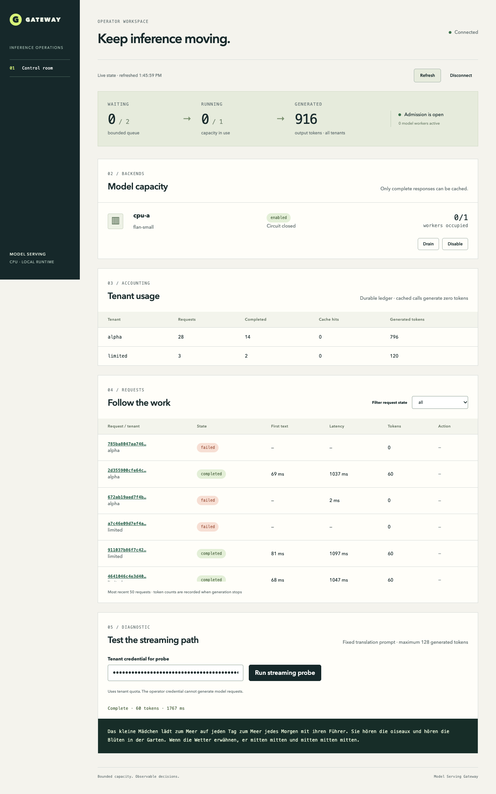

# Model Serving Gateway

A local inference gateway with bounded admission, tenant quotas, streaming cancellation and a React operator console. It runs the original Google FLAN-T5-small checkpoint on CPU, records request outcomes in SQLite, and uses Redis for quotas and optional tenant-scoped response caching.



## What it does

- Exposes one JSON/SSE request contract with authenticated tenant identity, unique request IDs, token limits and deadlines.
- Bounds active inference and queued work. Cancelling a request or disconnecting a streaming client stops generation cooperatively and joins its worker before returning capacity.
- Reserves output tokens in Redis, refunds unused tokens after completion and rejects admission when Redis is unavailable.
- Routes through revision-compatible backends with circuit breakers and draining. Failover is allowed only before any response text or final usage has been emitted.
- Retains request identity, measured usage, failures and operator actions without persisting prompts or generated text in SQLite. Optional cached responses remain in Redis until their TTL expires.
- Lets operators inspect capacity, usage and requests; drain or disable a backend; cancel work; and run a fixed streaming diagnostic with a separate tenant key.

## Run with Docker

The verified image is **Linux ARM64**, Python 3.10.11, PyTorch 1.13.1 and Transformers 4.30.2. Docker Desktop on an ARM Mac runs it natively. An x86 Docker host needs ARM emulation; its performance is not represented by the native benchmark.

From this repository, use Python 3.10 or later for the two dependency-free preparation commands:

```sh
python3 -m gateway.download "$HOME/.cache/model-serving-gateway/flan-t5-small"
python3 -m gateway.setup --model-directory "$HOME/.cache/model-serving-gateway/flan-t5-small"
docker compose up --build -d
```

The model download is approximately 311 MB. Every required artifact is checked against its pinned size and SHA-256 before installation and again before model loading. Existing corrupt files cause an error and are preserved for inspection. The setup command creates an owner-readable `.env` with distinct random credentials and refuses to replace an existing file. Compose reads that file, mounts the verified model read-only and persists SQLite and Redis in separate volumes.

Open **http://127.0.0.1:8093**. Use the operator key from your private `.env` to connect. The diagnostic panel separately requests the `alpha` tenant API key from `GATEWAY_TENANTS_JSON`. Keys stay in browser memory and clear on reload; they are not stored in localStorage. Readiness is available at `/health/ready` and the request schema at `/docs`.

The host port binds to loopback. The sample includes three tenants: `alpha` and `beta` for normal requests, and `limited` with two admitted requests per minute for the quota demonstration. Cache is disabled by the generated demo environment so repeated requests exercise the model.

## Send a request

Export the generated environment in a local shell. Source only the configuration you created and trust:

```sh
set -a
. ./.env
set +a
python3 scripts/demo.py --base-url http://127.0.0.1:8093
```

The demo uses Python's standard library and prints decoded streaming events. The request shape is:

```json
{"model":"flan-small","prompt":"Translate English to German: The house is wonderful.","max_new_tokens":64,"timeout_ms":30000}
```

Send it to `POST /v1/generate` for JSON or `POST /v1/stream` for SSE, with `Authorization: Bearer <tenant key>`. Supply a stable `request_id` when the caller must detect duplicate admission. Reusing it returns HTTP 409; read its status with `GET /v1/requests/{request_id}`. Successful responses include actual encoder/decoder token counts and measured latency. See [API behavior](docs/api.md).

## Run from source

The native development profile was verified with Python 3.10 on macOS ARM64. Keep environments and weights outside the source tree:

```sh
python3.10 -m venv ../serving-venv
. ../serving-venv/bin/activate
pip install --no-deps -r requirements.lock
pip check
pip install --no-deps .
npm --prefix frontend ci
npm --prefix frontend run build
```

Use Node 16.16 for the checked frontend dependency profile. Start a dedicated Redis instance on port 56383; for example:

```sh
docker run --name serving-local-redis -d -p 127.0.0.1:56383:6379 redis:7.0.11-alpine@sha256:121bac949fb5f623b9fa0b4e4c9fb358ffd045966e754cfa3eb9963f3af2fe3b
```

Run the download/setup commands above, export `.env`, then `python -m gateway`. Run from the repository to serve `frontend/dist`; the Python wheel contains the API and maintenance commands, while the Docker image includes the compiled console. The hashed Linux ARM wheel lock is a separate profile; it is not interchangeable with macOS or Linux x86 wheels.

## Verify and measure

```sh
TEST_REDIS_URL=redis://127.0.0.1:56383/0 python -m pytest -q
npm --prefix frontend test
npm --prefix frontend run build
PYTHONPATH=. python scripts/model_smoke.py --model-path "$GATEWAY_MODEL_PATH"
PYTHONPATH=. python scripts/http_benchmark.py --base-url http://127.0.0.1:8093
```

The HTTP benchmark requires the demo tenant names, cache disabled, one model slot and queue size two. It checks serial requests, a 12-request burst, both cancellation paths, a short deadline, tenant quota and an operator-disabled backend. Use a fresh quota window when repeating it. The optional `--redis-container` argument stops and starts the explicitly named dedicated Redis container to exercise an actual dependency outage.

For browser checks, `npm --prefix frontend exec -- playwright install chromium`, then `npm --prefix frontend run test:e2e` with the exported environment. `GATEWAY_URL` changes the target; `CHROME_PATH` can select an installed Chrome executable.

The checked-in native Linux ARM run measured eight serial requests with no errors, p50/p95 latency **1,171/1,226 ms**, p50/p95 first decoded text **76/243 ms**, and **51.7 generated tokens per successful request-second**. The 12-request burst rejected 9 requests (75%) with one active slot and two waiting slots. These are small shared-host measurements, not a throughput or availability promise. Full workload, per-request observations and measurement definitions are in [verification](docs/verification.md).

## Operating limits

This profile is one process, one CPU model slot and one SQLite ledger. It refuses a second owner of the same ledger. Multi-process/distributed request identity, high availability, GPU/vLLM and llama.cpp/GGUF are not implemented or measured. The router supports multiple compatible adapters in code; the supplied server registers one verified CPU backend.

FLAN-T5-small is suitable for exercising infrastructure, but its answers are unreliable: the retained smoke result answered “sarah” when the supplied owner was Mira. Model correctness requires a separate evaluation process. Deadlines and cancellation are cooperative; an individual native inference step must return before its thread can stop. Unrecoverable native hangs require process recovery, rather than claiming that capacity has been released.

See [architecture](docs/architecture.md), [operations and recovery](docs/runbook.md), and [third-party notices](THIRD_PARTY_NOTICES.md).
