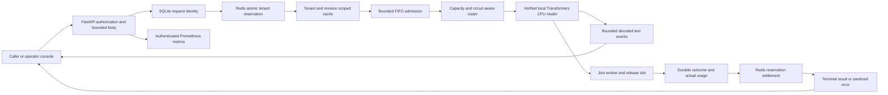

# Architecture and invariants

The authentication boundary supplies tenant identity. It never trusts tenant names in a generation body. Operator credentials cannot generate text, and tenant credentials cannot inspect another tenant's request. Keys are compared in constant time and are absent from database records and metrics.

SQLite reserves `(tenant, request_id)` before Redis admission. Equal repeated requests return `duplicate_request`; different options under the same identity return `identity_conflict`. Identity is not a response-replay cache. A fingerprint includes deadline and generation options; cache identity omits the caller's request ID/deadline but includes tenant, public model, exact checkpoint revision, prompt and sampling options. Nonzero-temperature requests bypass caching. Hits charge zero inference tokens but still consume a request admission.

Redis Lua uses server time, fixed-window request/output-token budgets and expiring concurrent leases. The gateway reserves the maximum output budget, then returns the unused portion once. A request that never enters generation receives its entire output reservation back. A backend failure without trustworthy final usage keeps a conservative reservation. Lost admission replies and process death can also retain budget until the window expires. This avoids optimistic accounting after ambiguous operations. The SQLite usage ledger records only observed counts; it is not a billing system.

The process admission queue is FIFO and bounded independently of Redis tenant limits. Model capacity remains allocated until the native generation thread has joined. Client disconnect, explicit cancellation and request deadline all signal cooperative stopping. A request deadline begins before Redis admission. Waiting network admission is bounded by that deadline; subsequent cleanup can outlast it.

The router enforces revision compatibility, per-backend capacity, mode and breaker state. Failure before the first nonempty decoded text or final usage may move to a compatible backend. Once either is emitted, retry is prohibited. Fixtures test these boundaries; the default deployment has one backend, so an unavailable model yields a failure instead of hidden failover.

Stream text is delivered before durable completion. A successful terminal event is delivered only after the ledger write. A ledger failure produces `ledger_unavailable`, closes further admission/readiness and still attempts worker cleanup, quota settlement and terminal delivery. Tokens already delivered are partial output and must not be interpreted as a successful response without the final `result` event.

SQLite uses WAL, FULL synchronous writes and explicit transactions. One advisory process lock protects recovery: startup marks unfinished records `abandoned` rather than rerunning them or erasing identity. Operator modes and circuit state are in memory and reset on restart; audit records persist. A planned maintenance restart therefore requires an external admission gate if the backend must remain unavailable afterward.

Metrics have bounded state and tenant labels, with no prompt, credential or request-ID labels. The console polls summaries and request metadata, verifies expected backend mode on updates and clears credentials on disconnect/reload. Redis caching retains generated text when enabled; SQLite and metrics do not.
